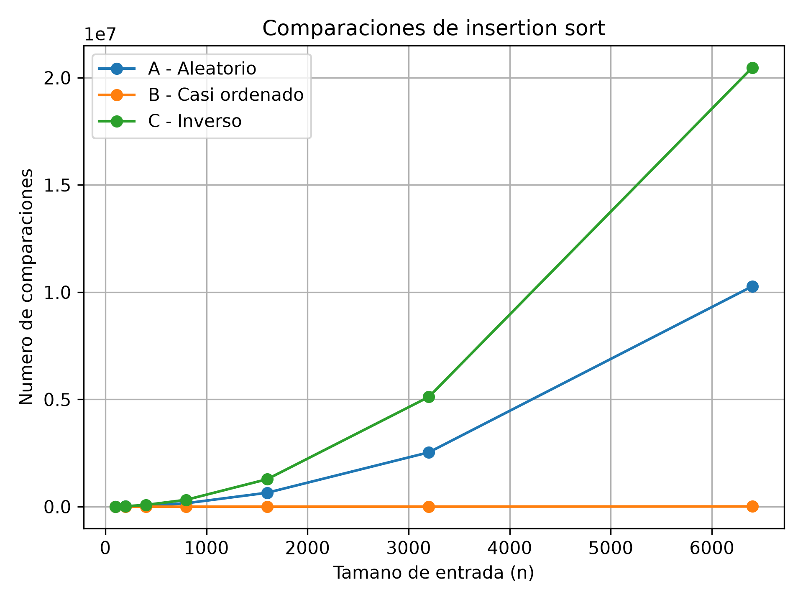
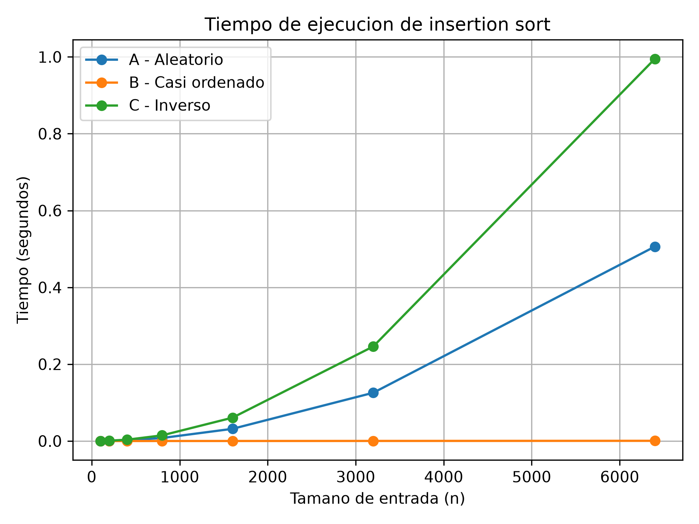
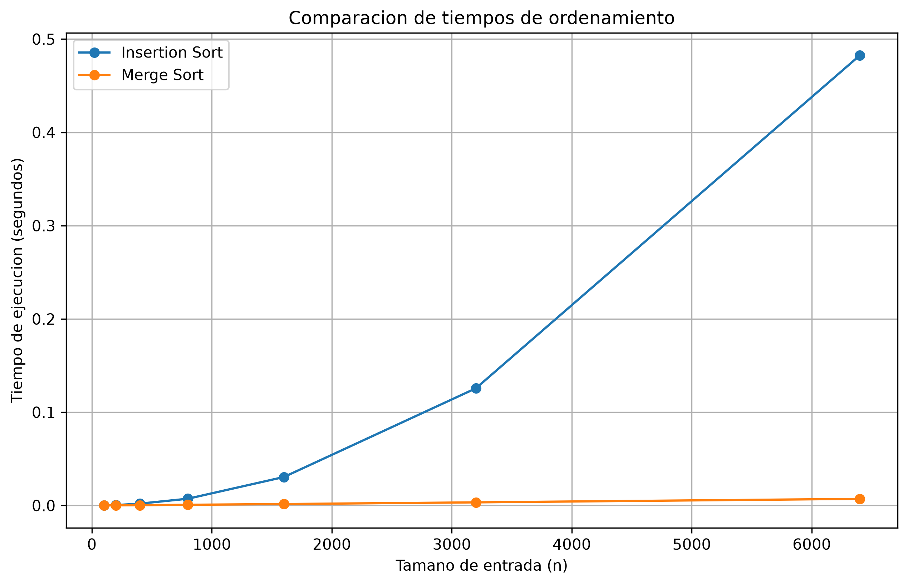

# Laboratorio evaluativo 01 — Fundamentos, complejidad y recurrencias

**Estudiante:** Carolina Arango Escobar

## Instrucciones para reproducir el experimento
Los algoritmos base se encuentran en [`algoritmos.py`](algoritmos.py) y los generadores de datos en [`datos.py`](datos.py). 

Para reproducir este laboratorio, abre la consola (CMD) en la raíz del repositorio y ejecuta:
1. Activar el entorno virtual: `venv\Scripts\activate.bat`
2. Ejecutar experimento de la Parte 3: `python lab1-fundamentos-complejidad-recurrencias/parte3_casos.py`
3. Ejecutar experimento de la Parte 4: `python lab1-fundamentos-complejidad-recurrencias/parte4_complejidad.py`

---

## Parte 1 — Analizar el algoritmo antes de comprar hardware

Un algoritmo correcto es el que da el resultado que esperamos, pero uno eficiente también tiene que hacerlo en el tiempo que tenemos disponible, en este caso 4 horas.

Por ejemplo, en Black Friday una tienda recibe muchísimas compras y necesita revisar cuáles productos se vendieron más. Si el programa compara cada compra con todas las demás, puede llegar al resultado correcto, pero se puede demorar demasiado.

Si hay 1.000 compras, hace muchísimas comparaciones, y si las compras aumentan a 2.000, el trabajo aumenta mucho más, porque el algoritmo crece como n².

Entonces, aunque dupliquemos el hardware y tengamos un computador más potente, no necesariamente se soluciona el problema. Si siguen aumentando las compras, el programa puede terminar demorándose más de las 4 horas permitidas.

Por eso, no solo importa que el algoritmo funcione, sino que también sea lo suficientemente rápido para las condiciones que tenemos.


---

## Parte 2 — Responsabilidad ambiental y ética de la implementación

La eficiencia de un algoritmo también tiene que ver con la cantidad de energía y recursos que utiliza el computador. Si un algoritmo es poco eficiente, puede tardar más tiempo y hacer que el procesador trabaje más, gastando más energía.

Esto puede traer algunos problemas, como un mayor consumo de electricidad y más uso del computador. Además, cuando se manejan muchos datos, esto puede hacer que otros programas tengan menos recursos disponibles.

Por eso, la responsabilidad es de todos. Los desarrolladores deben intentar crear algoritmos que sean adecuados y no gasten recursos de más. Por otro lado, las organizaciones también deben dar los recursos necesarios y tratar de usar la tecnología de una manera responsable.

---
## Parte 3 — Peor caso, mejor caso y caso promedio

### 3.1 — Explicación teórica

El peor caso de un algoritmo es la entrada que hace el mayor número de comparaciones o el mayor tiempo de ejecución dentro de todas las entradas posibles de un tamaño fijo `n`. El mejor caso es la entrada que necesita el menor número de comparaciones o tiempo para ese mismo tamaño. El caso promedio representa el comportamiento medio sobre un conjunto de entradas de tamaño `n`, considerando cómo se distribuyen las entradas.

En insertion sort, el peor caso es cuando los elementos están en sentido contrario al que necesitamos, porque el algoritmo debe mover muchos elementos. El mejor caso ocurre cuando la lista ya está ordenada y casi no se necesitan movimientos. El caso promedio es el que tiene entradas que no están completamente ordenadas ni completamente al revés.

Para decidir si Tamiza puede utilizar un algoritmo en producción, utilizaría el peor caso que considere entradas difíciles. Esto por que la ventana de cuatro horas es estricta y no se puede asumir que siempre llegarán datos fáciles de ordenar. El sistema debe terminar a las 6:00 a. m. para que los pacientes sean contactados correctamente.

Antes de realizar las mediciones, mi predicción es que el escenario C será el peor caso, porque los datos llegan de menor a mayor y Tamiza necesita ordenarlos de mayor a menor. El escenario B se acercará al mejor caso, porque el 98 % inicial ya está ordenado y solo una parte pequeña está desordenada al final. El escenario A se aproximará al caso promedio, porque sus datos llegan en un orden aleatorio.

### 3.2 — Demostración experimental

El código utilizado para realizar el experimento se encuentra en [código de la Parte 3](parte3_casos.py). La implementación de insertion sort está en [algoritmos.py](algoritmos.py) y los generadores de los escenarios están en [datos.py](datos.py).

Para el experimento se utilizaron los tamaños de entrada 100, 200, 400, 800, 1600, 3200 y 6400. Se midió el tiempo de ejecución utilizando `time.perf_counter()` y se contó el número de comparaciones entre elementos. El tiempo de generación de los datos no se incluyó en la medición.

**Gráfica de comparaciones**



**Gráfica de tiempo**



#### Análisis de los resultados

Los resultados confirmaron las predicciones iniciales. El escenario B presentó los menores tiempos y la menor cantidad de comparaciones. Por ejemplo, para 6.400 elementos se realizaron 10.277 comparaciones y el tiempo fue de 0.000578 segundos.

El escenario A presentó un comportamiento mayor que el escenario B. Para 6.400 elementos, realizó 10.276.753 comparaciones y tardó 0.506246 segundos.

El escenario C obtuvo los valores más altos. Para 6.400 elementos, realizó 20.476.800 comparaciones y tardó 0.995081 segundos. Esto demuestra que el orden inverso representa el peor caso para Insertion Sort.

Al aumentar el tamaño de los datos, el tiempo y las comparaciones también aumentaron. Por esta razón, el algoritmo puede resultar poco conveniente para procesar grandes cantidades de registros cuando existe una restricción de tiempo estricta.

---
## Parte 4 — Complejidad de Merge Sort e Insertion Sort

### 4.1. Cálculo teórico de la complejidad

#### Merge Sort

Merge Sort funciona dividiendo una lista en dos partes. Después, ordena cada parte y finalmente las une para formar una lista ordenada.

La fórmula de su recurrencia es:

T(n) = 2T(n/2) + Θ(n)

Al aplicar el método maestro, se obtiene una complejidad de:

**Θ(n log n)**

Esto significa que Merge Sort tiene la misma complejidad en el mejor caso, el caso promedio y el peor caso.

#### Insertion Sort

Insertion Sort funciona recorriendo los elementos y colocando cada uno en la posición que le corresponde dentro de la lista.

En el mejor caso, cuando los datos ya están ordenados, el algoritmo realiza pocas operaciones. Por eso, su complejidad es:

**Θ(n)**

En el peor caso, cuando los datos están ordenados de forma inversa, el algoritmo tiene que hacer muchos desplazamientos y comparaciones. En este caso, su complejidad es:

**Θ(n²)**

El caso promedio también tiene una complejidad de **Θ(n²)**.

#### Tabla comparativa

| Algoritmo | Mejor caso | Caso promedio | Peor caso |
|---|---|---|---|
| Insertion Sort | Θ(n) | Θ(n²) | Θ(n²) |
| Merge Sort | Θ(n log n) | Θ(n log n) | Θ(n log n) |

### 4.2. Validación experimental

Para comprobar la complejidad de los dos algoritmos, se realizaron pruebas utilizando datos aleatorios.

Los tamaños utilizados fueron:

```text
100, 200, 400, 800, 1600, 3200 y 6400
```

Para medir el tiempo se utilizó `time.perf_counter()`. La medición solamente incluye el tiempo que tarda en ejecutarse cada algoritmo y no incluye la generación de los datos.

#### Resultados obtenidos

| Tamaño (n) | Insertion Sort | Merge Sort |
|---|---:|---:|
| 100 | 0.000114 s | 0.000100 s |
| 200 | 0.000424 s | 0.000144 s |
| 400 | 0.002016 s | 0.000341 s |
| 800 | 0.007265 s | 0.000764 s |
| 1600 | 0.030529 s | 0.001576 s |
| 3200 | 0.125610 s | 0.003363 s |
| 6400 | 0.482499 s | 0.007110 s |

#### Gráfica de comparación



#### Análisis de los resultados

Al observar los resultados, se puede ver que Merge Sort tuvo un menor tiempo de ejecución en todos los tamaños probados.

Insertion Sort aumenta su tiempo más rápidamente a medida que aumenta la cantidad de datos. En cambio, Merge Sort mantiene un crecimiento más bajo.

Esto coincide con la teoría, ya que Insertion Sort tiene una complejidad promedio de O(n²), mientras que Merge Sort tiene una complejidad de O(n log n).

Por lo tanto, Merge Sort es más eficiente cuando se trabaja con listas grandes.

### 4.3. Concepto técnico para la Secretaría de Salud

Para el sistema de la Secretaría de Salud se necesita ordenar aproximadamente 1.200.000 registros en un tiempo máximo de cuatro horas. Por esta razón, es importante escoger un algoritmo que pueda trabajar con muchos datos sin tardar demasiado.

En las pruebas realizadas con 6.400 elementos, Insertion Sort tardó 0.482499 segundos, mientras que Merge Sort tardó 0.007110 segundos. Esto muestra que Merge Sort tuvo un mejor tiempo de ejecución en las pruebas realizadas.

Insertion Sort tiene una complejidad de O(n²) en el caso promedio y en el peor caso. Esto quiere decir que su tiempo puede aumentar bastante cuando la cantidad de datos crece. Aunque puede funcionar bien con listas pequeñas o casi ordenadas, no es la mejor opción para trabajar con millones de registros.

Por otro lado, Merge Sort tiene una complejidad de O(n log n). Su crecimiento es más controlado y permite trabajar mejor con cantidades grandes de información.

Al realizar una estimación desde 6.400 hasta 1.200.000 registros, se calculó que Insertion Sort podría tardar aproximadamente 4,71 horas. Merge Sort podría tardar aproximadamente 2,13 segundos. Estos valores son solamente estimaciones, porque el tiempo real depende del computador, el procesador, la memoria y otros factores.

Si se utilizara un servidor más rápido, el tiempo de Insertion Sort podría disminuir. Sin embargo, esto no cambia su complejidad cuadrática y tampoco garantiza que siempre cumpla con el tiempo máximo de cuatro horas.

Por estas razones, se propone utilizar Merge Sort para este sistema, ya que presentó mejores resultados y tiene una complejidad más adecuada para grandes cantidades de datos. Antes de utilizarlo en producción, sería necesario realizar más pruebas con datos reales y comprobar que los resultados del ordenamiento sean correctos.

También se debe tener en cuenta que Merge Sort necesita memoria adicional para dividir y unir las listas. Por eso, se debe revisar que el servidor tenga los recursos necesarios.

Con las pruebas realizadas se pudo comprobar que Merge Sort es más rápido que Insertion Sort cuando aumenta el tamaño de los datos. Insertion Sort puede ser útil para listas pequeñas o casi ordenadas, pero su complejidad O(n²) hace que tarde más con grandes cantidades de elementos.

Merge Sort tiene una complejidad O(n log n) y presentó mejores tiempos en las pruebas. Por este motivo, sería una opción más adecuada para el sistema de la Secretaría de Salud.