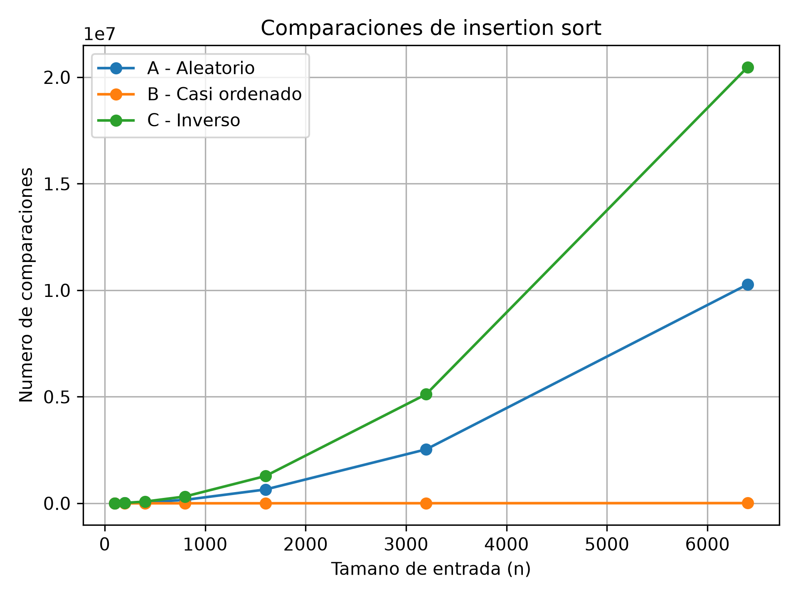
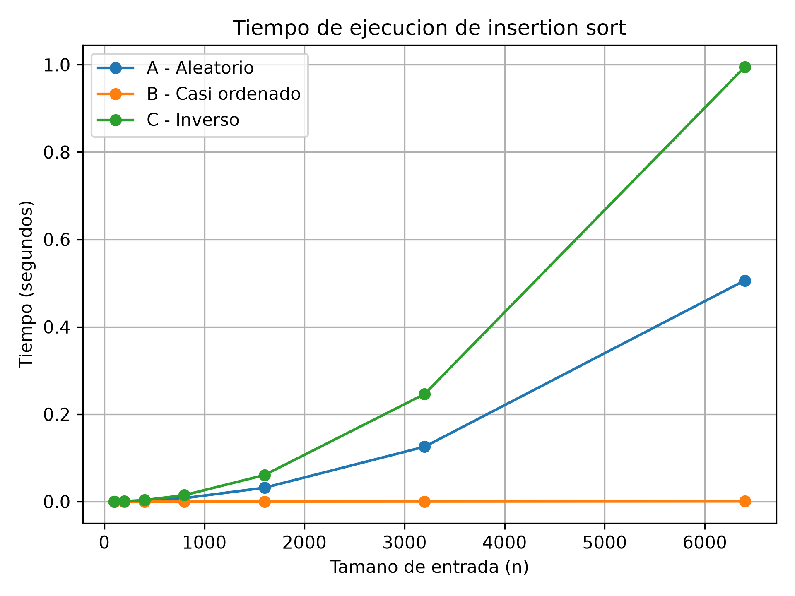
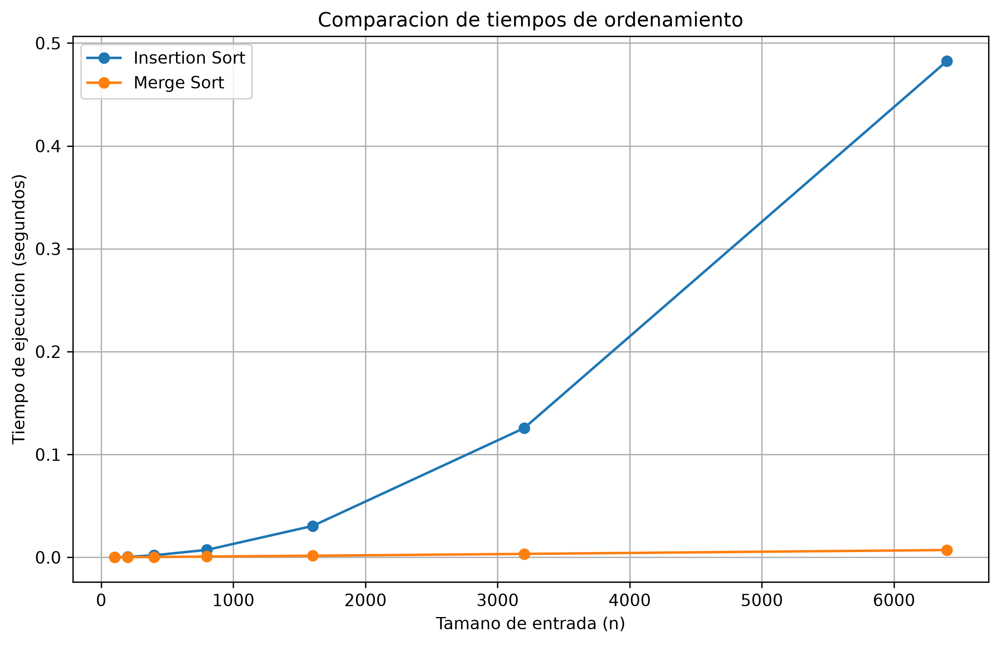

# Laboratorio 1 — Fundamentos, complejidad y recurrencias

**Nombre:** Carolina Arango Escobar

## Objetivo

En este laboratorio se estudia la importancia de analizar un algoritmo no solamente por si entrega el resultado correcto, sino también por el tiempo y los recursos que necesita para hacerlo.

Se trabaja principalmente con el algoritmo Insertion Sort y se compara posteriormente con Merge Sort.

---

# Cómo ejecutar el laboratorio

Este laboratorio fue realizado en **Windows utilizando CMD**.

## 1. Ubicarse en la carpeta del repositorio

Desde CMD:

```cmd
cd "C:\Users\Caro\Desktop\OCTAVO SEMESTRE\Analisis de algoritmos\curso-analisis-algoritmos"
```

Después entrar a la carpeta del laboratorio:

```cmd
cd laboratorios\lab1-fundamentos-complejidad-recurrencias
```

## 2. Activar el entorno virtual

El entorno virtual está ubicado en la raíz del repositorio. Desde la carpeta del laboratorio se activa con:

```cmd
..\..\venv\Scripts\activate
```

Si se activó correctamente, debe aparecer `(venv)` al comienzo de la línea en CMD.

## 3. Ejecutar la Parte 3

```cmd
python parte3_casos.py
```

Este programa realiza las pruebas de Insertion Sort y genera las siguientes gráficas:

- `graficas\parte3_comparaciones.png`
- `graficas\parte3_tiempo.png`

## 4. Ejecutar la Parte 4

```cmd
python parte4_complejidad.py
```

Este programa compara Insertion Sort y Merge Sort y genera:

- `graficas\parte4_tiempo.png`

---

# Parte 1 — Analizar el algoritmo antes de comprar hardware

## 1.1. Corrección y eficiencia

Que un algoritmo sea correcto significa que entrega el resultado que se espera. Sin embargo, esto no quiere decir que sea eficiente.

En el caso de Tamiza, Insertion Sort puede ordenar correctamente los pacientes de mayor a menor riesgo. El problema aparece cuando la cantidad de datos es muy grande y el algoritmo tarda demasiado en terminar.

La plataforma debe procesar aproximadamente **1.200.000 registros** durante la madrugada. El proceso empieza a las **2:00 a. m.** y debe terminar antes de las **6:00 a. m.**, por lo que solamente hay una ventana de **cuatro horas**.

Entonces, un algoritmo puede ser correcto y aun así no ser adecuado para el sistema si no logra terminar dentro de ese límite de tiempo.

## 1.2. ¿Qué pasa si se compra un servidor dos veces más rápido?

Comprar un servidor con el doble de velocidad puede reducir el tiempo de ejecución, pero no cambia la forma en que crece el trabajo del algoritmo.

Insertion Sort tiene una complejidad de **O(n²)** en el caso promedio y en el peor caso. Esto significa que cuando aumenta mucho la cantidad de datos, el tiempo puede aumentar rápidamente.

Por eso, antes de comprar un servidor más rápido, también se debe revisar si el algoritmo utilizado es apropiado para la cantidad de información que se necesita procesar.

## 1.3. Otro ejemplo: Black Friday

Un ejemplo diferente sería una tienda en línea durante Black Friday. Supongamos que la tienda tiene **500.000 productos** y utiliza un algoritmo que necesita cada vez más tiempo para buscar y organizar la información.

Si una consulta tiene como límite responder en máximo **2 segundos**, pero el algoritmo tarda **10 segundos**, el resultado puede ser correcto, pero el sistema no está cumpliendo con la restricción de tiempo.

Comprar un computador más rápido podría disminuir el tiempo, pero si el problema está en la forma en que crece el algoritmo, la solución principal debería ser revisar el algoritmo.

Esto es parecido al caso de Tamiza: no basta con que la lista de pacientes esté correctamente ordenada. También es necesario que esté lista antes de las **6:00 a. m.**

---

# Parte 2 — Responsabilidad ambiental y ética

## 2.1. Dimensión ambiental

El tiempo que tarda un algoritmo también puede afectar el consumo de recursos.

Mientras el servidor está ejecutando el algoritmo, utiliza el procesador, la memoria y otros componentes. Si el algoritmo tarda más tiempo, estos recursos permanecen funcionando durante más tiempo y se consume más energía.

En Tamiza esto es todavía más importante porque el proceso no se ejecuta una sola vez. Se realiza todas las madrugadas sobre los registros de los pacientes.

Por ejemplo, una diferencia pequeña de tiempo en una sola ejecución puede parecer poco importante. Sin embargo, si esa diferencia se repite todas las noches durante meses o años, el consumo adicional se va acumulando.

Por esta razón, escoger un algoritmo que pueda terminar más rápido también puede ayudar a disminuir el uso innecesario de recursos del servidor.

## 2.2. Dimensión ética

El problema no solamente afecta al servidor. También puede afectar directamente a las personas que utilizan el sistema.

Un primer caso sería el de un **paciente con un riesgo alto** que no aparece a tiempo en la lista porque el algoritmo no alcanzó a terminar antes de las 6:00 a. m. Esto podría hacer que la llamada se retrase y que el paciente no sea contactado cuando correspondía.

En este caso, el principal perjuicio lo recibe el paciente, porque puede retrasarse su atención. La Secretaría también asume el costo porque es responsable del funcionamiento de la plataforma.

Un segundo caso sería el de un **operador del centro de contacto** que recibe una lista incompleta o que no representa correctamente las prioridades. El operador tendría que trabajar con información que no está en las condiciones esperadas y podría terminar llamando a pacientes en un orden incorrecto.

En este caso, el operador también asume parte del costo porque debe enfrentar las consecuencias del problema del sistema, mientras que la Secretaría debe responder por el funcionamiento de la plataforma.

## 2.3. La importancia del orden de la lista

En Tamiza, el orden de los pacientes no es solamente una decisión técnica.

La lista determina a quién se llama primero. Si los pacientes se organizan de mayor a menor riesgo, los pacientes con mayor necesidad deberían ser contactados primero.

Por esta razón, el algoritmo tiene dos responsabilidades importantes:

1. Entregar correctamente la lista ordenada.
2. Terminar dentro de la ventana de tiempo disponible.

Si la lista queda incompleta o mal ordenada, no solamente existe un problema de rendimiento, sino que también puede afectar la forma en que se prioriza la atención de las personas.

---

# Parte 3 — Mejor, promedio y peor caso

[Ver código de la Parte 3](parte3_casos.py)

Los algoritmos utilizados en esta parte se encuentran en [algoritmos.py](algoritmos.py) y los datos de prueba se generan mediante [datos.py](datos.py).

## 3.1. Definición de los casos

Para un tamaño fijo `n`, se pueden analizar diferentes entradas y observar cuánto tiempo necesita el algoritmo para procesarlas.

### Peor caso

Es el **máximo tiempo de ejecución** que puede necesitar el algoritmo entre todas las entradas posibles de tamaño `n`.

### Mejor caso

Es el **mínimo tiempo de ejecución** que puede necesitar el algoritmo entre todas las entradas posibles del mismo tamaño `n`.

### Caso promedio

Representa el tiempo de ejecución promedio sobre diferentes entradas de tamaño `n`, teniendo en cuenta las posibles formas en que pueden llegar los datos.

En el caso de Tamiza, considero más importante analizar el peor caso porque existe una ventana de tiempo estricta. El proceso debe terminar antes de las **6:00 a. m.**, por lo que no sería conveniente depender de que los datos lleguen siempre en una condición favorable.

## 3.2. Predicción antes de realizar las pruebas

Antes de realizar los experimentos, se esperaba lo siguiente:

- **Escenario A — Aleatorio:** debería representar aproximadamente el caso promedio.
- **Escenario B — Casi ordenado:** debería acercarse al mejor caso.
- **Escenario C — Inverso:** debería representar el peor caso.

Esto se debe a que Insertion Sort funciona mejor cuando los elementos ya están cerca del orden que se necesita y tiene que realizar muchos más desplazamientos cuando los elementos están en el orden contrario.

## 3.3. Resultados

### Escenario A — Datos aleatorios

| n | Tiempo | Comparaciones |
|---:|---:|---:|
| 100 | 0.000122 s | 2542 |
| 200 | 0.000428 s | 9970 |
| 400 | 0.001923 s | 40436 |
| 800 | 0.007867 s | 160484 |
| 1600 | 0.031759 s | 648481 |
| 3200 | 0.125663 s | 2533103 |
| 6400 | 0.506246 s | 10276753 |





### Escenario B — Casi ordenado

| n | Tiempo | Comparaciones |
|---:|---:|---:|
| 100 | 0.000006 s | 100 |
| 200 | 0.000015 s | 203 |
| 400 | 0.000023 s | 417 |
| 800 | 0.000069 s | 866 |
| 1600 | 0.000106 s | 1851 |
| 3200 | 0.000240 s | 4172 |
| 6400 | 0.000578 s | 10277 |

### Escenario C — Inverso

| n | Tiempo | Comparaciones |
|---:|---:|---:|
| 100 | 0.000209 s | 4950 |
| 200 | 0.000936 s | 19900 |
| 400 | 0.003410 s | 79800 |
| 800 | 0.014717 s | 319600 |
| 1600 | 0.060762 s | 1279200 |
| 3200 | 0.246195 s | 5118400 |
| 6400 | 0.995081 s | 20476800 |

## 3.4. Análisis de los resultados

Los resultados coinciden con la predicción realizada antes de las pruebas.

El escenario **C, con datos en orden inverso**, fue el que presentó los mayores tiempos y el mayor número de comparaciones. Por esto se puede considerar el peor caso para Insertion Sort.

El escenario **B, casi ordenado**, fue el más rápido y tuvo muchas menos comparaciones. Esto coincide con el comportamiento esperado del mejor caso.

El escenario **A, aleatorio**, quedó entre los dos anteriores y representa aproximadamente el comportamiento del caso promedio.

Por ejemplo, para `n = 6400`, el escenario B tardó solamente **0.000578 segundos**, mientras que el escenario C tardó **0.995081 segundos**. Esto muestra que la forma en que llegan los datos puede cambiar bastante el tiempo de ejecución de Insertion Sort.

La tendencia también coincide con la complejidad teórica de Insertion Sort:

- Mejor caso: **Θ(n)**
- Caso promedio: **Θ(n²)**
- Peor caso: **Θ(n²)**

---

# Parte 4 — Complejidad de Merge Sort e Insertion Sort

[Ver código de la Parte 4](parte4_complejidad.py)

La implementación de los algoritmos se encuentra en [algoritmos.py](algoritmos.py).

## 4.1. Cálculo teórico

### Merge Sort

Merge Sort utiliza la estrategia de dividir y vencer.

Primero divide la lista en dos partes, después ordena cada parte de manera recursiva y finalmente mezcla las dos partes ordenadas.

La recurrencia es:

```text
T(n) = 2T(n/2) + Θ(n)
```

Cada término tiene un significado:

- `2T(n/2)` representa las **dos llamadas recursivas** que se realizan al dividir la lista.
- `n/2` significa que cada subproblema tiene aproximadamente la mitad del tamaño de la lista original.
- `Θ(n)` representa el costo de **mezclar las dos listas**, porque para realizar la mezcla se deben recorrer los elementos.

Por eso se obtiene:

```text
T(n) = 2T(n/2) + Θ(n)
```

### Método maestro

Para aplicar el método maestro se identifican los siguientes valores:

```text
a = 2
b = 2
f(n) = Θ(n)
```

Ahora calculamos:

```text
n^(log_b(a))
```

Reemplazando `a = 2` y `b = 2`:

```text
n^(log_2(2))
```

Como:

```text
log_2(2) = 1
```

entonces:

```text
n^1 = n
```

Por lo tanto:

```text
n^(log_b(a)) = Θ(n)
```

También tenemos:

```text
f(n) = Θ(n)
```

Entonces:

```text
f(n) = Θ(n^(log_b(a)))
```

Esto corresponde al **caso 2 del método maestro**.

Por lo tanto:

```text
T(n) = Θ(n log n)
```

Así que Merge Sort tiene una complejidad de **Θ(n log n)** en el mejor caso, caso promedio y peor caso.

---

### Insertion Sort

Para analizar Insertion Sort se revisa cuántas veces se realizan sus principales operaciones.

Primero se copia la lista original para no modificar los datos recibidos. Copiar los `n` elementos tiene un costo de:

```text
O(n)
```

Después se ejecuta el ciclo principal:

```python
for i in range(1, len(lista)):
```

Este ciclo se ejecuta:

```text
n - 1
```

veces.

### Mejor caso

En el mejor caso, la lista ya está ordenada de la forma que necesita el algoritmo.

En cada iteración se realiza aproximadamente una comparación y no es necesario realizar muchos desplazamientos.

Entonces:

```text
n - 1 ≈ n
```

Por lo tanto:

```text
T(n) = Θ(n)
```

### Peor caso

En el peor caso, los elementos están ordenados de forma inversa. Esto hace que cada nuevo elemento tenga que compararse y desplazarse varias posiciones.

El número de operaciones se puede representar como:

```text
1 + 2 + 3 + ... + (n - 1)
```

La suma es:

```text
n(n - 1) / 2
```

Desarrollando:

```text
(n² - n) / 2
```

El término que más crece es `n²`, por lo que:

```text
T(n) = Θ(n²)
```

### Caso promedio

En el caso promedio, los datos no están completamente ordenados ni completamente invertidos. Los elementos normalmente necesitan realizar algunos desplazamientos.

Aunque el número de desplazamientos es menor que en el peor caso, sigue creciendo proporcionalmente a `n²`.

Por esto:

```text
T(n) = Θ(n²)
```

### Tabla de complejidades

| Algoritmo | Mejor caso | Caso promedio | Peor caso |
|---|---|---|---|
| Insertion Sort | Θ(n) | Θ(n²) | Θ(n²) |
| Merge Sort | Θ(n log n) | Θ(n log n) | Θ(n log n) |

---

## 4.2. Validación experimental

Para comparar los dos algoritmos se utilizaron datos aleatorios del escenario A.

Los tamaños utilizados fueron:

```text
100, 200, 400, 800, 1600, 3200 y 6400
```

El tiempo se midió utilizando `time.perf_counter()`. La medición solamente incluye la ejecución del algoritmo y no la generación de los datos.

### Resultados

| Tamaño (n) | Insertion Sort | Merge Sort |
|---:|---:|---:|
| 100 | 0.000114 s | 0.000100 s |
| 200 | 0.000424 s | 0.000144 s |
| 400 | 0.002016 s | 0.000341 s |
| 800 | 0.007265 s | 0.000764 s |
| 1600 | 0.030529 s | 0.001576 s |
| 3200 | 0.125610 s | 0.003363 s |
| 6400 | 0.482499 s | 0.007110 s |

### Gráfica



### Análisis

En los tamaños pequeños las dos curvas están relativamente cerca. Esto ocurre porque cuando `n` es pequeño la diferencia entre los crecimientos de los algoritmos todavía no es tan grande. Además, Merge Sort tiene algunos costos adicionales relacionados con las llamadas recursivas y la creación y mezcla de listas.

Cuando el tamaño aumenta, la diferencia se hace mucho mayor.

Por ejemplo, con `n = 6400`:

- Insertion Sort tardó **0.482499 segundos**.
- Merge Sort tardó **0.007110 segundos**.

Esto significa que Merge Sort fue mucho más rápido en este tamaño.

La curva de Insertion Sort crece mucho más rápido y coincide con su complejidad promedio de **O(n²)**.

La curva de Merge Sort crece más lentamente, lo que coincide con su complejidad de **O(n log n)**.

Por lo tanto, los resultados experimentales coinciden con la predicción teórica.

---

## 4.3. Extrapolación a 1.200.000 registros

Para hacer una estimación se tomó como punto de partida el resultado medido con **6400 registros**, porque fue el tamaño más grande utilizado en el experimento.

### Insertion Sort

El tiempo medido para 6400 elementos fue:

```text
0.482499 segundos
```

Primero se calcula cuánto aumenta el tamaño:

```text
1.200.000 / 6400 = 187,5
```

Como Insertion Sort tiene un crecimiento aproximado de `n²`, se eleva este factor al cuadrado:

```text
187,5² = 35.156,25
```

Entonces:

```text
0.482499 × 35.156,25
≈ 16.962,86 segundos
```

Convertimos a horas:

```text
16.962,86 / 3600
≈ 4,71 horas
```

Por lo tanto, la estimación para Insertion Sort es de aproximadamente:

**4,71 horas**

Esta estimación supera la ventana disponible de cuatro horas.

### Merge Sort

Para Merge Sort se utilizó su crecimiento `n log n`.

El tiempo medido con 6400 elementos fue:

```text
0.007110 segundos
```

Se calcula el factor de crecimiento utilizando `n log₂(n)`:

```text
(1.200.000 × log₂(1.200.000)) /
(6400 × log₂(6400))
≈ 299,47
```

Entonces:

```text
0.007110 × 299,47
≈ 2,13 segundos
```

Por lo tanto, la estimación para Merge Sort es de aproximadamente:

**2,13 segundos**

Estos valores son solamente estimaciones. No representan una medición directa con 1.200.000 registros, ya que el tiempo real también depende del procesador, memoria, implementación y otros factores del equipo.

---

## 4.4. ¿Es suficiente comprar un servidor dos veces más rápido?

No considero que comprar un servidor dos veces más rápido sea la solución principal.

En la prueba realizada con **6400 elementos**, Insertion Sort tardó **0.482499 segundos**, mientras que Merge Sort tardó **0.007110 segundos**.

Estos datos se pueden observar en la gráfica anterior.


Un servidor dos veces más rápido podría disminuir el tiempo de ejecución de Insertion Sort. Sin embargo, no cambiaría su complejidad de `O(n²)`.

Además, la cantidad de registros puede seguir creciendo, por lo que el problema volvería a aparecer.

Por esta razón, considero más importante cambiar a un algoritmo que tenga un crecimiento más adecuado para grandes cantidades de datos, en lugar de depender solamente de mejorar el hardware.

---

## 4.5. Recomendación para Tamiza

Recomiendo utilizar **Merge Sort** como algoritmo de ordenamiento para Tamiza.

Aunque Insertion Sort puede funcionar muy bien cuando los datos llegan casi ordenados, el canal de entrada puede cambiar y no se puede garantizar que los datos siempre lleguen de esa forma.

Por esta razón, considero mejor utilizar una sola implementación de Merge Sort, ya que tiene un comportamiento más estable independientemente de cómo lleguen los datos.

Además, en las pruebas realizadas Merge Sort presentó mejores tiempos que Insertion Sort. Con 6400 elementos, por ejemplo, tardó **0.007110 segundos**, mientras que Insertion Sort tardó **0.482499 segundos**.

La principal desventaja de Merge Sort es que necesita memoria adicional para realizar la división y la mezcla de las listas. Por eso, antes de utilizarlo en producción se debe comprobar que el servidor tenga suficiente memoria y realizar pruebas con datos reales.

En conclusión, para Tamiza prefiero utilizar Merge Sort porque el sistema trabaja con una cantidad grande de registros y necesita cumplir una ventana de tiempo estricta.

---

# Conclusión general

En este laboratorio se pudo comprobar que analizar un algoritmo no consiste solamente en verificar si entrega el resultado correcto. También es necesario revisar cuánto tiempo y recursos necesita.

Las pruebas con Insertion Sort mostraron que el orden de los datos influye bastante en su tiempo de ejecución. El escenario casi ordenado fue el más rápido, mientras que el escenario inverso fue el más lento.

También se comparó Insertion Sort con Merge Sort. Los resultados mostraron que Merge Sort tiene un mejor comportamiento cuando aumenta la cantidad de datos.

Por estas razones, para un sistema como Tamiza, que debe procesar aproximadamente 1.200.000 registros en una ventana de cuatro horas, se recomienda utilizar Merge Sort en lugar de depender de Insertion Sort o solamente aumentar la velocidad del servidor.