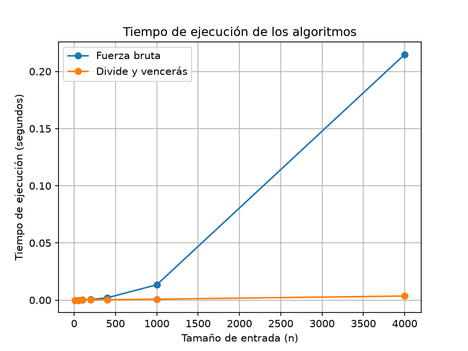

# Laboratorio 2 — Dividir y vencer

**Nombre:** Carolina Arango Escobar

## Cómo ejecutar el laboratorio

Primero se debe activar el entorno virtual desde la carpeta principal del repositorio:

```cmd
venv\Scripts\activate
```

Después se entra a la carpeta del laboratorio:

```cmd
cd laboratorios\lab2-divide-y-vencer
```

Para ejecutar las pruebas de la Parte 1 se utiliza:

```cmd
python pruebas.py
```

## Parte 1 — Implementar y verificar las soluciones

Código utilizado:

* [subarreglo.py](subarreglo.py)
* [pruebas.py](pruebas.py)

En esta parte se implementaron dos formas de encontrar el subarreglo máximo. La primera utiliza fuerza bruta y prueba los diferentes tramos posibles acumulando la suma. La segunda utiliza divide y vencerás, separando la lista en dos partes y teniendo en cuenta los casos izquierdo, derecho y cruzado.

Para verificar que las dos soluciones funcionaran correctamente se hicieron varias pruebas. Primero se utilizó la serie de ocho días de la situación planteada, cuyo resultado esperado es una suma de `17`. También se probó una lista de un solo elemento, una lista con todos los valores negativos y otra con todos los valores positivos.

Además, se hizo una prueba donde el mejor tramo cruza el punto medio, para comprobar que esta parte del algoritmo funcionara correctamente. Finalmente, se generaron 20 listas aleatorias y se comparó la suma obtenida por los dos algoritmos.

Las pruebas se realizaron usando `assert` y todas las pruebas deben terminar mostrando el mensaje:

```text
Todas las pruebas pasaron correctamente.
```

## Parte 2 — Medición y gráfica

Código utilizado:

* [medicion.py](medicion.py)

Para esta parte se midió el tiempo de ejecución de los dos algoritmos usando siete tamaños de entrada: `10`, `50`, `100`, `200`, `400`, `1000` y `4000`.

Los datos se generaron con una semilla fija y con valores enteros entre `-100` y `100`. Para cada tamaño se utilizó la misma lista para los dos algoritmos, para que la comparación se hiciera con los mismos datos.

El tiempo se midió utilizando `time.perf_counter()` y solamente se tuvo en cuenta el tiempo de ejecución de cada algoritmo. La generación de los datos y la comprobación de los resultados se hicieron por fuera de la medición.

Cada tamaño se midió tres veces y se utilizó la mediana de los resultados. También se verificó dentro del experimento que la suma encontrada por fuerza bruta y por divide y vencerás fuera la misma en cada tamaño.

Los resultados obtenidos fueron los siguientes:

| Tamaño (n) | Fuerza bruta (s) | Divide y vencerás (s) |
| ---------: | ---------------: | --------------------: |
|         10 |         0.000003 |              0.000006 |
|         50 |         0.000032 |              0.000032 |
|        100 |         0.000120 |              0.000068 |
|        200 |         0.000492 |              0.000136 |
|        400 |         0.002031 |              0.000304 |
|       1000 |         0.013418 |              0.000828 |
|       4000 |         0.214927 |              0.003559 |

### Gráfica
-
La siguiente gráfica muestra los tiempos obtenidos para los dos algoritmos:



En los tamaños pequeños los tiempos son bastante cercanos. A medida que aumenta el tamaño de la entrada se empieza a notar más la diferencia entre los dos algoritmos, especialmente en `n = 4000`, donde fuerza bruta tarda más que divide y vencerás.

## Parte 3 — Análisis

### 1. Recurrencia

Para divide y vencerás, el problema se divide en dos partes de tamaño `n/2` y después se revisa el caso que cruza el punto medio. Este último paso cuesta `Θ(n)` porque se recorren los elementos de las dos mitades. Por eso la recurrencia es:

`T(n) = 2T(n/2) + Θ(n)`

En el método maestro, `a = 2`, `b = 2` y `f(n) = Θ(n)`. Como `n^(log₂2) = n`, corresponde al caso 2 y el resultado es `Θ(n log n)`. En fuerza bruta hay dos ciclos para probar los posibles inicios y finales, por lo que su complejidad es `Θ(n²)`.

### 2. Lo medido contra lo esperado

Los resultados muestran que fuerza bruta crece más rápido. Por ejemplo, al pasar de `n=100` a `n=200`, su tiempo pasó de `0.000120 s` a `0.000492 s`, un aumento de aproximadamente `4.10` veces. En cambio, divide y vencerás pasó de `0.000068 s` a `0.000136 s`, que es `2` veces.

También de `n=200` a `n=400`, fuerza bruta aumentó aproximadamente `4.13` veces y divide y vencerás `2.24` veces. Esto se parece a lo esperado: al duplicar `n`, `Θ(n²)` crece cerca de 4 veces y `Θ(n log n)` crece un poco más de 2 veces.

### 3. Tamaños pequeños

En los tamaños pequeños no siempre gana divide y vencerás. Con `n=10`, fuerza bruta fue más rápida (`0.000003 s` frente a `0.000006 s`) y con `n=50` los tiempos fueron iguales. Desde `n=100` en nuestra medición ya empieza a verse la ventaja de divide y vencerás. Esto puede pasar porque con entradas pequeñas el costo de las llamadas recursivas y de dividir el problema puede compensar la ventaja de su menor complejidad.

### 4. ¿Cuándo conviene dividir?

Para encontrar el máximo de un arreglo se puede recorrer una sola vez y guardar el mayor valor encontrado, con costo `Θ(n)`. Si se divide en dos partes, la recurrencia sería `T(n)=2T(n/2)+Θ(1)`, porque combinar los dos resultados solo necesita una comparación. El resultado también es `Θ(n)`. Por eso en este caso dividir no mejora la complejidad y recorrer directamente el arreglo es más sencillo.

### 5. Concepto para la gerente

Recomendaría usar divide y vencerás para la cooperativa, especialmente si se van a analizar cientos de miles de registros. En `n=4000`, fuerza bruta tardó `0.214927 s` y divide y vencerás `0.003559 s`. Usando estas mediciones y sus complejidades, para `1.000.000` de registros se estima aproximadamente `3.73 horas` para fuerza bruta y cerca de `1.48 segundos` para divide y vencerás. Estos valores son solo estimaciones, no mediciones reales. La diferencia muestra que para cantidades grandes de datos conviene usar divide y vencerás.
